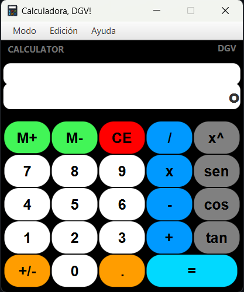
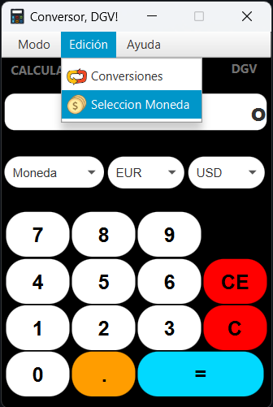
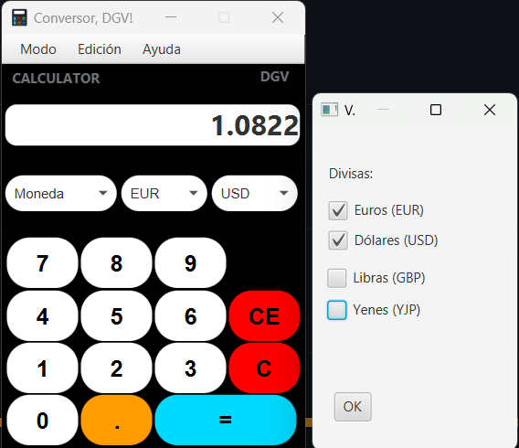

# Calculadora DGV

> **Empaquetado**
> El proyecto incluye empaquetado en un único fichero **jar**.

------------
- Este Proyecto esta basado en la practica [ Practica 7.3 Caclculadora Científica](https://github.com/javiertraseira/practica7-3-DI " Practica 7.3 Caclculadora Científica")

## Parte 1

La calculadora incluye un  **menú superior** que permite alternar entre la calculadora **basica** y una **científica**.

- El menú superior muestra dos entradas de *Modo*, *Edición* y *Ayuda*.
    - **Modo**, acceso a calculadora *basica* o *cientifíca*.
    - **Edición**, acceso a *conversor* y *tema*.
    - **Ayuda**, acceso a una pequeña informacion del proyecto.
- La **calculadora científica** contiene las operaciones trigonométricas y exponenciales.

 

## Parte 2

**calculadora de conversiones**

- El *sistema de conversiones* contiene un *Combobox* principal para seleccionar el método de conversión; puedes alternar entre 3 tipos de conversiones, *Moneda*, *Longitud* y *Tiempo*. 
- Hay dos **combobox** de valor de *origen* y valor *destino*. 
- Para las conversiones monetarias se incluye en el menu una pestaña para la elección de tipo de moneda esta pestaña te da acceso a una *Ventana Modal* que fijará el *valor de conversión*.

  

## Parte 3 (opcional)

Realizado alguna mejora:

- Agrega un acceso a una **API** para obtener el valor del cambio.