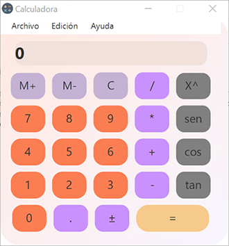
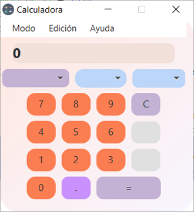
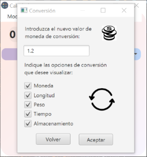

# Práctica 7.3 Calculadora científica y de conversiones

> **Warning**
> El proyecto deberá venir empaquetado como mínimo en un único fichero **jar**, y opcionalmente, en un ejecutable de Windows para poder ejecutarse.

## Parte 1

Mejora la calculadora de la práctica anterior agregándole un **menú superior** que permita alternar entre la calculadora **normal** y una nueva calculadora **científica** que se cargará dentro del mismo *Stage*.

- El menú superior mostrará también dos entradas de *Edición* y *Ayuda*.
- La **calculadora científica** deberá tener al menos las operaciones trigonométricas y exponenciales o porcentajes.

 

## Parte 2

Agrega otra opción al menú para tener una **calculadora de conversiones**.

- El *sistema de conversiones* deberá tener un *Combobox* principal para seleccionar el método de conversión; deberá poder hacer 3 tipos de conversiones, incluída la monetaria (agregar otras como longitud, tiempo, etc.). 
- Se deberán agregar dos *combobox* de valor de origen y valor destino. 
- Para las conversiones monetarias se deberá fijar el *valor de conversión* desde otra **ventana modal** que se abrirá desde el menú Edición.

  

## Parte 3 (opcional)

Realiza algunas de estas mejoras propuestas:

- Agrega un **historial** de operaciones sencillo que utilice un *listView* para almacenarlos.
- Agrega un acceso a una **API** para obtener el valor del cambio.
- Agrega **Responsividad** a la calculadora científica de forma que la ventana sea redimensionable. Si a la calculadora científica se le reduce el tamaño pasará a ser calculadora normal y si se vuelve a ampliar calculadora científica.
- Agrega una **gráfica** para representar funciones matemáticas.